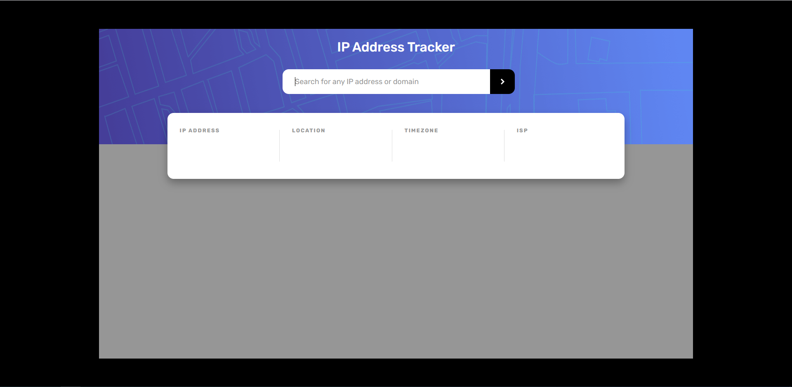
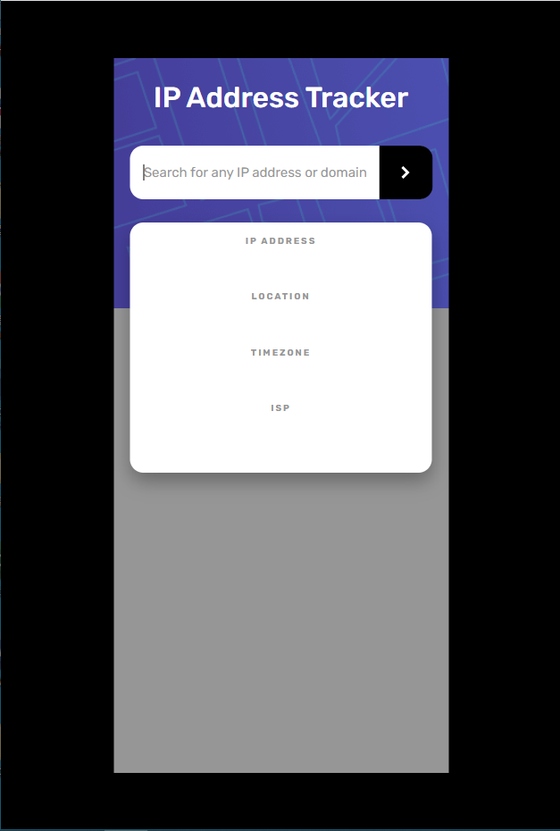

# Frontend Mentor - IP address tracker solution

This is a solution to the [IP address tracker challenge on Frontend Mentor](https://www.frontendmentor.io/challenges/ip-address-tracker-I8-0yYAH0).

## Table of contents

- [Overview](#overview)
  - [The challenge](#the-challenge)
  - [Screenshot](#screenshot)
  - [Links](#links)
- [My process](#my-process)
  - [Built with](#built-with)
  - [What I learned](#what-i-learned)
  - [Continued development](#continued-development)
  - [Useful resources](#useful-resources)
- [Author](#author)

## Overview

### The challenge

Users should be able to:

- View the optimal layout for each page depending on their device's screen size
- See hover states for all interactive elements on the page
- See their own IP address on the map on the initial page load
- Search for any IP addresses or domains and see the key information and location

### Screenshot

;
;

### Links

- Solution URL: [https://github.com/codernineteen/ip-address-tracker/tree/main](https://github.com/codernineteen/ip-address-tracker/tree/main)
- Live Site URL: [https://ip-address-tracker-zeta-six.vercel.app](https://ip-address-tracker-zeta-six.vercel.app)

## My process

### Built with

- Semantic HTML5 markup
- CSS custom properties
- Flexbox
- Leaflet map, geoIpfy API
- Mobile-first workflow

### What I learned

API request(fetch)

- There is a lot of method for requesting GET method from api
- I choose fetch because it looked simple
- Fetch function works with promise. so i needed to use '.then()' to wait response

```js
const result = fetch(geoEndPoint)
  .then((response) => response.json())
  .then((result) => {
    return result;
  });
```

- Also i should use async function because i can't treat results from api at the same time. I used code below

```js
const makeLocation = async () => {
  const a = await result;
  lat = a.location.lat;
  lng = a.location.lng;
};
// used arrow function
```

Media queries

- To make responsive website, I need to change ratio of width as to screen size
- I realized i only can use 'px' unit to max-width and min-width although i using 'rem' unit in my whole css code

How to read API docs

- It was really difficult to understand several api docs as a non-native of English
- First, i should focus on what programming language i'm using
- Second, If there is no problem with my project, Just copy and paste code into my project and see what happened
- Third, If i can't get clear solution from docs, i can search it on google(There will be a lot of programmers who already used the api and suffered from similar problems)

### Continued development

Now i feel easier using CSS and javascript for frontend than before.
Next project will be cloning Youtube from scratch on my own.
To do this project, i need to review python basic syntax and flask for sever part.
After finish next project, I guess it will be okay learning javascript fronend framework like React, vue

### Useful resources

- [fetch functon](https://levelup.gitconnected.com/) - This helped me know about how to use fetch function to request api data

## Author

- Website - [codernineteen](https://github.com/codernineteen/ip-address-tracker/tree/main)
- Frontend Mentor - [@codertwenty](https://www.frontendmentor.io/profile/codertwenty)

## Acknowledgments
